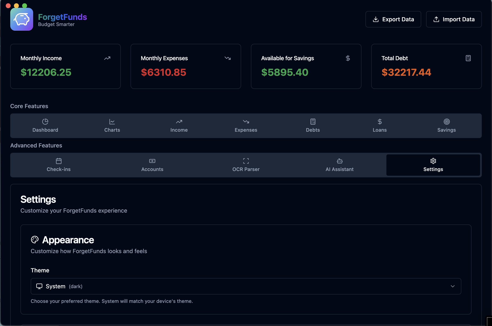

<div align="center">
  
  
  # ForgetFunds
  
  A modern, local-first budget management application built with Electron, React, TypeScript, and shadcn/ui. Features AI-powered expense estimation and comprehensive financial tracking.

**Built as a Turbo monorepo with pnpm workspaces for scalable development.**

## Screenshot



[](https://buymeacoffee.com/angelo.girardi)

</div>

## Features

- 🏠 **Local-First**: All data stored locally with optional JSON import/export
- 🎨 **Modern UI**: Built with shadcn/ui and Tailwind CSS
- 📊 **Comprehensive Tracking**:
  - Income sources with multiple frequencies
  - Revolving debts (credit cards)
  - Installment loans (car leases, personal loans)
  - Recurring and one-time expenses
  - Savings buckets with categories and priorities
- 🤖 **AI-Powered Estimates**: Location-based grocery estimates and lifestyle-based entertainment budgets
- 📈 **Advanced Analytics**:
  - Debt burndown projections
  - Savings growth charts
  - Cash flow visualization
  - Financial health metrics
- 💾 **Data Persistence**: Automatic saving with Electron Store
- 📁 **Import/Export**: JSON-based data portability

## Tech Stack

- **Architecture**: Turbo monorepo with pnpm workspaces
- **Frontend**: React 18, TypeScript, Tailwind CSS
- **UI Components**: shadcn/ui (Radix UI primitives)
- **Desktop**: Electron
- **Charts**: Recharts
- **Icons**: Lucide React
- **Build Tool**: Vite
- **Package Manager**: pnpm
- **Monorepo Tool**: Turborepo
- **Code Quality**: ESLint, Prettier
- **Data Storage**: SQLite with better-sqlite3

## Development Setup

### Prerequisites

- Node.js (v18 or higher)
- pnpm (v8 or higher) - `npm install -g pnpm`

### Installation

1. Clone the repository:

   ```bash
   git clone <repository-url>
   cd local_first_budget_app
   ```

2. Install dependencies:

   ```bash
   pnpm install
   ```

3. Start the development server:
   ```bash
   pnpm dev:desktop
   ```

### Available Scripts

**Monorepo Commands:**

- `pnpm dev` - Start all development servers
- `pnpm dev:desktop` - Start desktop app development
- `pnpm build` - Build all packages and apps
- `pnpm lint` - Run ESLint across all packages
- `pnpm lint:fix` - Fix ESLint issues across all packages
- `pnpm format` - Format code with Prettier
- `pnpm format:check` - Check code formatting
- `pnpm type-check` - Run TypeScript type checking
- `pnpm test` - Run tests across all packages
- `pnpm clean` - Clean all build artifacts and node_modules

## Project Structure

This is a **Turbo monorepo** organized with **pnpm workspaces**:

```
├── apps/
│   └── desktop/         # Electron desktop application
│       ├── src/
│       │   ├── main/    # Electron main process
│       │   ├── preload/ # Electron preload scripts
│       │   └── renderer/ # React frontend
│       └── package.json
├── packages/
│   ├── business-logic/  # Core business logic
│   ├── data-layer/      # Database and data management
│   ├── shared-types/    # TypeScript type definitions
│   ├── shared-components/ # Reusable UI components
│   └── sync-engine/     # Data synchronization (future)
├── tools/
│   ├── build-scripts/   # Build and deployment tools
│   └── development-tools/ # Development utilities
├── pnpm-workspace.yaml  # pnpm workspace configuration
├── turbo.json          # Turborepo pipeline configuration
└── package.json        # Root package.json
```

### Key Benefits of This Architecture:

- 🚀 **Fast builds** with Turborepo's intelligent caching
- 📦 **Shared packages** for code reuse across apps
- 🔧 **Efficient dependency management** with pnpm workspaces
- 🎯 **Scalable** - ready for mobile apps and web versions

## Features Overview

### Dashboard

- Monthly income vs expenses overview
- Available savings calculation
- Total debt tracking
- Financial health indicators

### Income Management

- Multiple income sources
- Flexible frequency options (weekly, bi-weekly, monthly)
- Automatic monthly conversion

### Debt Tracking

- **Revolving Debts**: Credit cards with APR calculations
- **Installment Loans**: Car leases, personal loans with fixed terms
- Debt payoff projections and interest calculations

### Expense Categories

- **Recurring Expenses**: Monthly bills and subscriptions
- **One-Time Expenses**: Moving costs, deposits (excluded from monthly budget)

### Savings Buckets

- Categorized savings goals (Emergency, Investment, Lifestyle, Education)
- Priority-based allocation
- Progress tracking with completion estimates

### AI Assistant

- **Location-Based Estimates**: Grocery costs adjusted by city
- **Lifestyle Survey**: Entertainment budget based on habits
- Automatic expense category population

### Analytics & Charts

- Debt burndown timeline
- Savings growth projection
- Monthly cash flow visualization
- Budget breakdown pie charts

## Data Management

### Local Storage

- All data automatically saved using Electron Store
- No cloud dependencies
- Privacy-focused design

### Import/Export

- JSON format for data portability
- Version tracking for compatibility
- Menu-driven file operations

## Support Development

If you find ForgetFunds helpful, consider supporting its development:

[](https://buymeacoffee.com/angelo.girardi)

Your support helps maintain and improve ForgetFunds for everyone!

## Contributing

1. Fork the repository
2. Create a feature branch
3. Make your changes
4. Run linting and formatting: `npm run lint:fix && npm run format`
5. Test your changes
6. Submit a pull request

## License

MIT License - see LICENSE file for details
